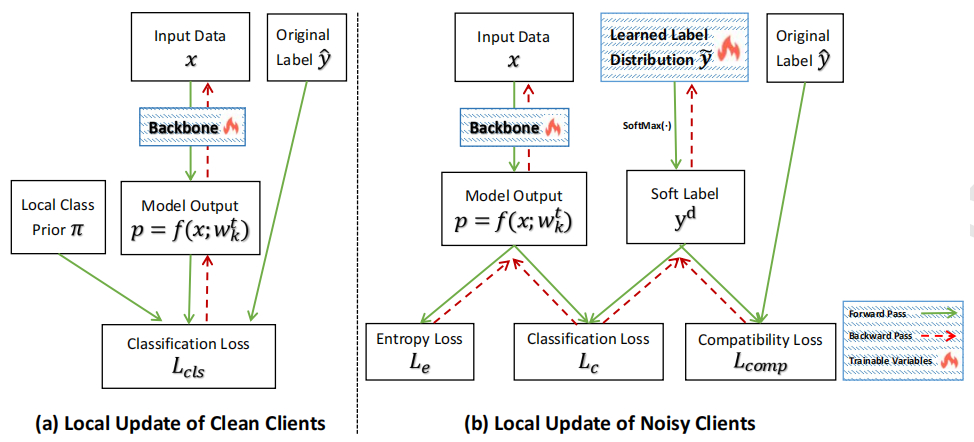

# FedELC
Official codes for CIKM '24 full paper: Tackling Noisy Clients in Federated Learning with End-to-end Label Correction. The Arxiv preprint is available in [here](https://arxiv.org/abs/2408.04301).

## Abstract
In this work, we propose a two-stage framework FedELC to tackle this complicated label noise issue. The first stage aims to guide the detection of noisy clients with higher label noise, while the second stage aims to correct the labels of noisy clients' data via an end-to-end label correction framework which is achieved by learning possible ground-truth labels of noisy clients' datasets via back propagation. We implement sixteen related methods and evaluate five datasets with three types of complicated label noise scenarios for a comprehensive comparison. Extensive experimental results demonstrate our proposed framework achieves superior performance than its counterparts for different scenarios. Additionally, we effectively improve the data quality of detected noisy clients' local datasets with our label correction framework.



## Dataset
We use CIFAR-10, CIFAR-100, CIFAR-10-N, CIFAR-100-N, and one large-scale online clothing datasets Clothing1M for evaluation. We list a table as below:

| Dataset | #Classes | #Train Set | #Test Set | Label Noise Pattern | Extra Information  |
| :-----: | :------: | :--------: | :-------: | :----------------: | :----------------: |
| CIFAR-10 |    10    |   50,000   |   10,000  | Manual Injected | -  |
| CIFAR-100|    100   |   50,000   |   10,000  | Manual Injected | -  |
| CIFAR-10-N|   10 |   50,000   |   10,000  |  Human Annotation Error | https://github.com/UCSC-REAL/cifar-10-100n  |
| CIFAR-100-N| 100  |   50,000   |   10,000  | Human Annotation Error  | https://github.com/UCSC-REAL/cifar-10-100n  |
| Clothing1M|   14 | 1,000,000  |   10,000 | Systematic | https://github.com/Cysu/noisy_label  |

For the last three datasets, considering related copyrights, please refer to the corresponding links for more details and dataset requisition.

## Usage
> bash fedELC.sh

please refer to the `./utils/options.py` for more details. 

## Key Dependencies
- Python 3.8
- PyTorch 1.8.1
- scikit-learn 1.3.2

## Citing this work
If you find this work useful in your research, please consider citing some helpful papers as listed below. We refer to FedNoRo (`IJCAI'23`), FedRN (`CIKM'22`), FedLSR (`CIKM'22`) and PENCIL (`ICCV'19`) to build this codebase.

We also release a benchmark study entitled **FNBench**, and you can find it via [this link](https://www.techrxiv.org/users/691169/articles/1215740-fnbench-benchmarking-robust-federated-learning-against-noisy-labels). The full version of FNBench which contains 17 baselines will be open-sourced in our future work entitled FNBench, please stay tuned.

Collaboration and pull requests are always welcome! If you have any questions or suggestions, please feel free to contact me : )

```bibtex
@article{jiang2024tackling,
  title={Tackling Noisy Clients in Federated Learning with End-to-end Label Correction},
  author={Jiang, Xuefeng and Sun, Sheng and Li, Jia and Xue, Jingjing and Li, Runhan and Wu, Zhiyuan and Xu, Gang and Wang, Yuwei and Liu, Min},
  journal={arXiv preprint arXiv:2408.04301},
  year={2024}
}

@article{Jiang_2024,
title={FNBench: Benchmarking Robust Federated Learning against Noisy Labels},
url={http://dx.doi.org/10.36227/techrxiv.172503083.36644691/v1},
DOI={10.36227/techrxiv.172503083.36644691/v1},
publisher={Institute of Electrical and Electronics Engineers (IEEE)},
author={Jiang, Xuefeng and Li, Jia and Wu, Nannan and Wu, Zhiyuan and Li, Xujing and Sun, Sheng and Xu, Gang and Wang, Yuwei and Li, Qi and Liu, Min},
year={2024},
}

@inproceedings{wu2023fednoro,
  title={FedNoRo: towards noise-robust federated learning by addressing class imbalance and label noise heterogeneity},
  author={Wu, Nannan and Yu, Li and Jiang, Xuefeng and Cheng, Kwang-Ting and Yan, Zengqiang},
  booktitle={Proceedings of the Thirty-Second International Joint Conference on Artificial Intelligence},
  pages={4424--4432},
  year={2023}
}

@inproceedings{kim2022fedrn,
  title={FedRN: Exploiting k-reliable neighbors towards robust federated learning},
  author={Kim, SangMook and Shin, Wonyoung and Jang, Soohyuk and Song, Hwanjun and Yun, Se-Young},
  booktitle={Proceedings of the 31st ACM International Conference on Information \& Knowledge Management},
  pages={972--981},
  year={2022}
}

@inproceedings{jiang2022towards,
  title={Towards federated learning against noisy labels via local self-regularization},
  author={Jiang, Xuefeng and Sun, Sheng and Wang, Yuwei and Liu, Min},
  booktitle={Proceedings of the 31st ACM International Conference on Information \& Knowledge Management},
  pages={862--873},
  year={2022}
}

@inproceedings{yi2019probabilistic,
  title={Probabilistic end-to-end noise correction for learning with noisy labels},
  author={Yi, Kun and Wu, Jianxin},
  booktitle={Proceedings of the IEEE/CVF conference on computer vision and pattern recognition},
  pages={7017--7025},
  year={2019}
}
```
